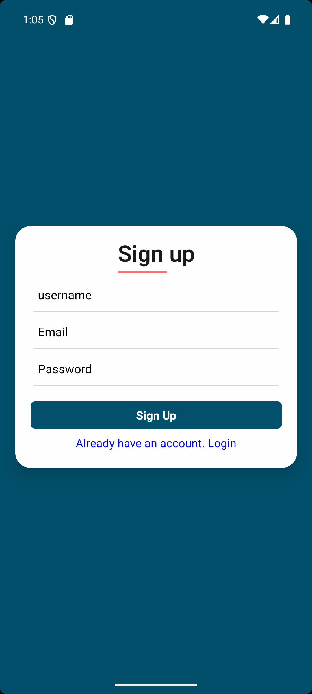
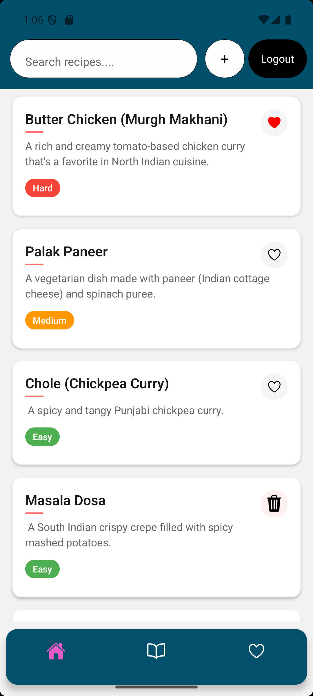
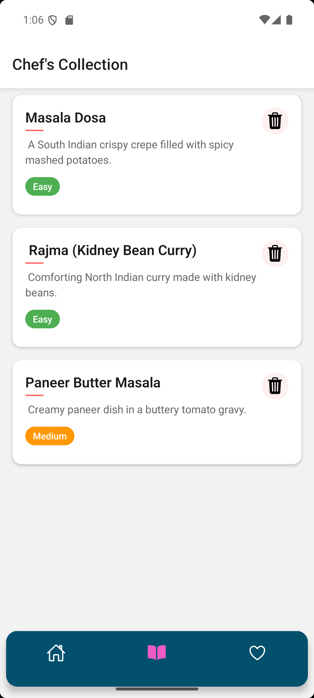
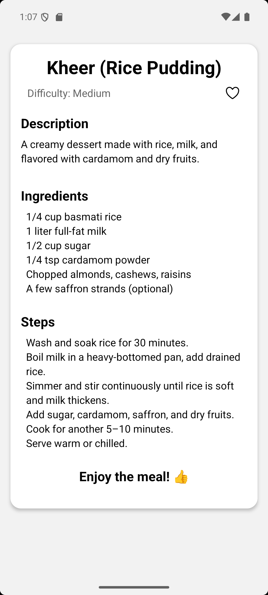
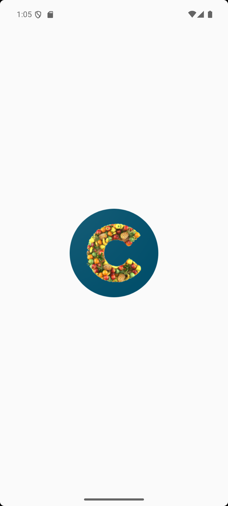

# Chefs Compass (A Recipe Book) 📖🍲

A full-stack recipe management app with user authentication, personalized recipe collections, and favorites. Built using React Native, Express, and SQLite.

## 🔐 Signup Page



## 🏠 Home Page



## ❤️ Favourite Page


## 📚 My Collection Page



## 📖 Recipe Book Page



## 🖼️ App Logo



---

## 🚀 Features

- User authentication (Sign up & login)
- Add, view, and manage personal recipes
- Mark recipes as favorites
- Organize and categorize your recipe collection
- Mobile-responsive and fast

## 🛠️ Tech Stack

- **Frontend:** React Native
- **Backend:** Express.js
- **Database:** MongoDB
- **Authentication**: JWT

---

## 🚀 Getting Started

1. Clone the repository:
   ```bash
   git clone https://github.com/your-username/ChwfsCompass.git
   cd recipe-app

2. Install dependencies
  ```bash
   npm install
  ```
3. Start the development server:
   ```
   npm sun start
   ```
4. build
   ```
   npx react-native run-android
   ```
5. Run the backend server:
   ```
   cd backend
    npm run dev
   ```

## 🙌 Credits
Made with ❤️ by dedJack

## 📩 Contact
For suggestions or collaboration, reach out via [ workwithaman0@gmail.com ]
